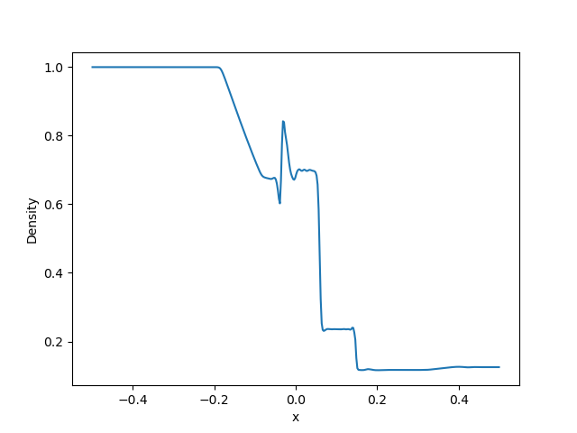
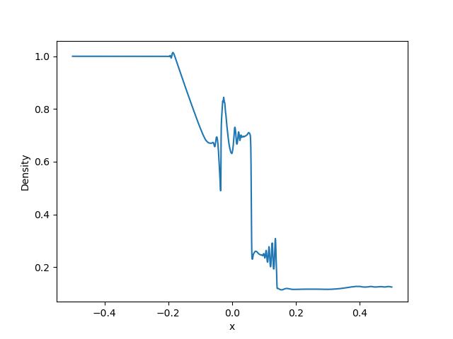

## Shock Tube Problem
This problem demonstrates the Hall-MHD version of the standard MHD shock tube problems adopted in `1D/SERIAL/shock`. 
Due to the dispersive nature of Hall-MHD, discontinuous jumps and smooth rarefaction waves of MHD solutions may be distorted.

The following shows the density profile of the Hall-MHD version of the Brio & Wu problem[^1] (Set `NUM` being `2` in `mhd1d_init_.cpp`). 
The ion inertia length *di=0.001* is used. 
The solution in the left plot is close to the MHD solution because the grid width *&Delta;x=0.0025* is larger than the ion inertia length. 
In contrast, the dispersive wave train appears behind discontinuties in the right plot when the grid width *&Delta;x=0.000625* is smaller than the ion inertia length. 

[^1]: [Amano, T. 2015, JCP](https://www.sciencedirect.com/science/article/abs/pii/S0021999115004805?via%3Dihub)
