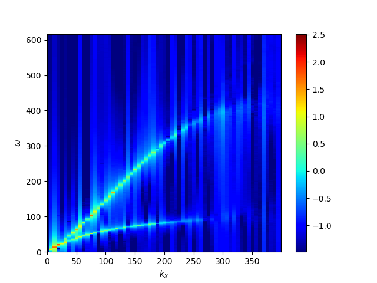

## Wave Propagation Problem
This problem demonstrates the propagation of Hall-MHD waves in homogeneous plasma to confirm that the code successfully satisfies the linear dispersion. 
Random white noise is added to the magnetic field and pressure, and their perturbations propagate as the whistler and ion cyclotron,  and magnetosonic waves.

The result for *&beta;=10* and the ion inertia length *di=4&Delta;x* is shown below. 
Dispersion relation of the whistler and ion cyclotron waves is observed in the spectrum plot of the magnetic field.

It is well known that the dispersive nature of the whistler waves (phase velocity proportional to wavenumber) is unfavorable condition for Hall-MHD simulations in terms of numerical stability. 
To relax this problem, the code can introduce the upper bound to the phase velocity of whistler waves through an "artificial" electron inertia, motivated by the study of Amano[^1]. 

The result for *&beta;=10*, the ion inertia length *di=4&Delta;x*, and the electron inertia length *de=&Delta;x* is shown below. 
The dispersion relation of the whistler wave *&omega; = Vadik2* is modified to *&omega; = Vadik2/(1+de2k2)*, limiting the maximum phase velocity to *Vadi/de*.

[^1]: [Amano, T. 2015, JCP](https://www.sciencedirect.com/science/article/abs/pii/S0021999115004805?via%3Dihub)
