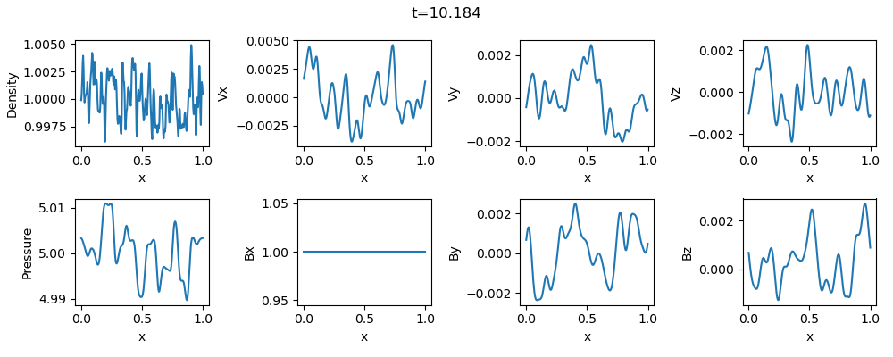
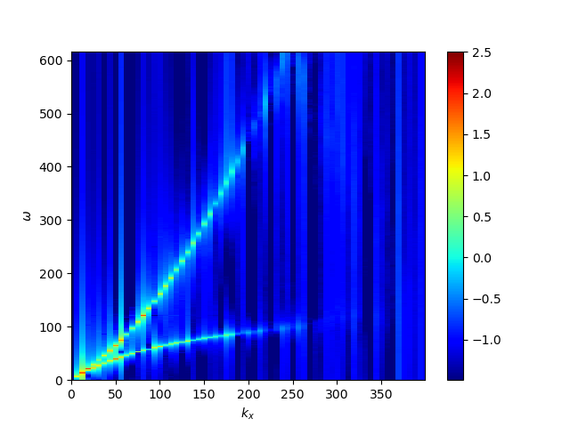

## Wave Propagation Problem
This problem demonstrates the propagation of Hall MHD waves in homogeneous plasma to confirm that the code successfully satisfies the linear dispersion. 
Random white noise is added to the magnetic field and pressure, and their perturabations propagate as the whistler and ion cyclotron,  and magnetosonic waves.

The result for *&beta;=10* and the ion inertia length of *4&Delta;x* is shown below. 
Dispersion relation of the whistler and ion cyclotron is observed in the spectrum plot of the magnetic field.

