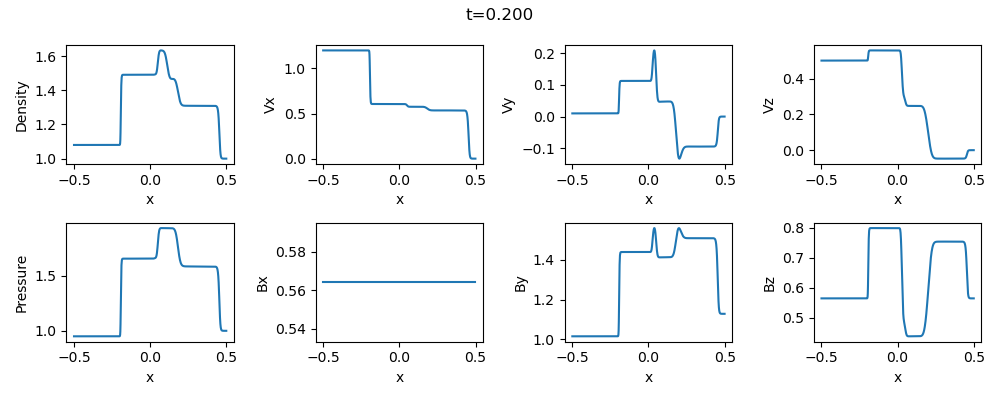
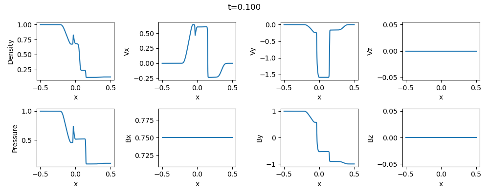
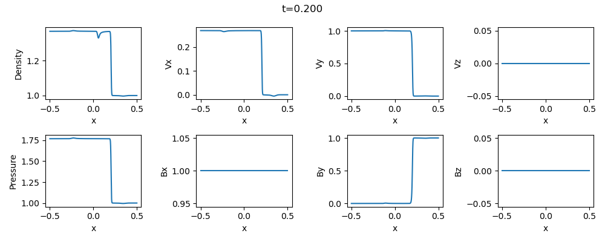
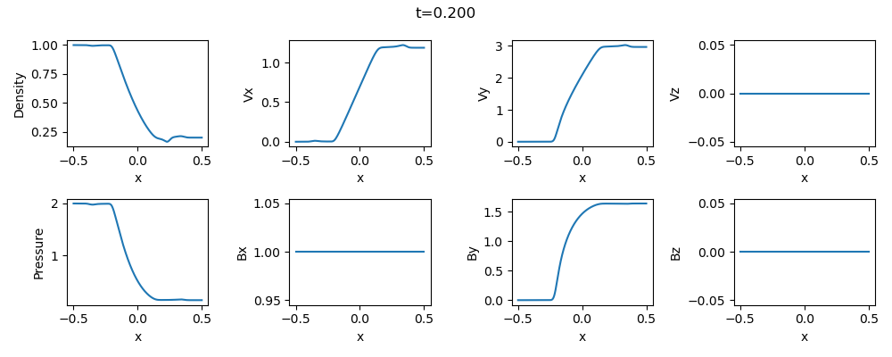
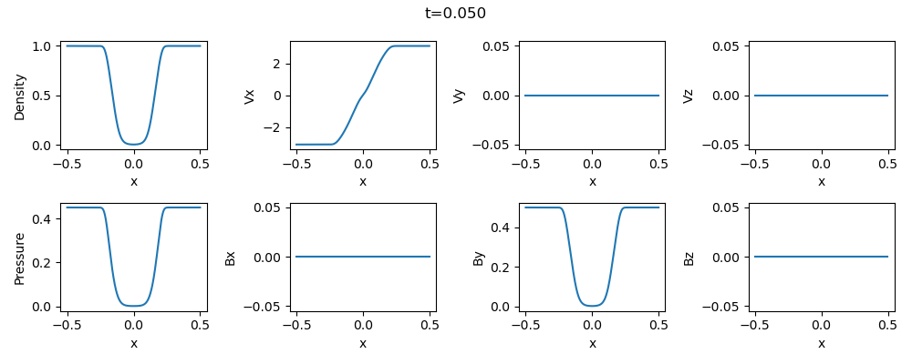
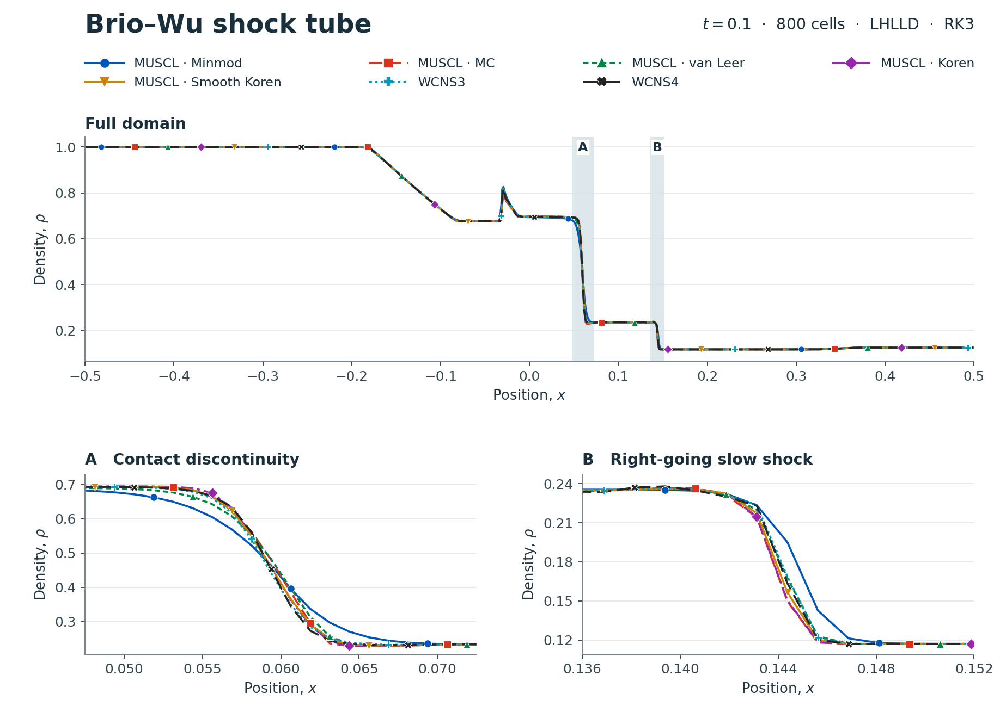

## Shock Tube Problem
The shock tube problem is a standard benchmark test for compressible (M)HD simulations, in which fluids with two different thermodynamic states are separated by a diaphragm in a tube. 
The diaphragm is instantaneously removed at *t=0*, and then fluids evolve to produce a variety of shocks, rarefaction waves, and discontinuities depending on the initial condition.

Here, users can demonstrate five standard MHD shock tube problems adopted by Miyoshi and Kusano[^1], by editting the macro `NUM` in `mhd1d_init_.cpp`:
1. Dai & Woodward problem
2. Brio & Wu problem
3. Slow switch-off shock
4. Slow switch-off rarefaction
5. Super-fast expansion

Example results for each problem are shown below. These figures were regenerated with `XMESH=800`, `RMN=2` (LHLLD), `ODR=1`, `R_K=2`, `CFL=0.4`, and `DTREC=0.01`, using GCC 16.2.0 (C++17, `-O2`) and `OMP_NUM_THREADS=2`.

To reproduce them, set `NUM` to each problem number, rebuild and run as described in the [SERIAL guide](../README.md), then use `batch.py` to select output indices `20`, `10`, `20`, `20`, and `5`, respectively.

1. Dai & Woodward problem (`t=0.200`)

2. Brio & Wu problem (`t=0.100`)

3. Slow switch-off shock (`t=0.200`)

4. Slow switch-off rarefaction (`t=0.200`)

5. Super-fast expansion (`t=0.050`)

### Brio–Wu density at `t=0.1`

The seven runs give nearly identical density profiles at the scale of the full tube. The lower panels show where the methods differ. Minmod spreads the contact discontinuity near `x=0.06` over more cells than the other methods. The right-going slow shock near `x=0.145` spans only a few cells in all seven runs.

To reproduce the comparison, set `NUM=2` in `mhd1d_init_.cpp`. In `mymacros.hpp`, use `XMESH=800`, `RMN=2` (LHLLD), `R_K=3` (three-stage Runge–Kutta), `CFL=0.4`, `DTREC=0.01`, and `N_OUT=10` for all runs. For MUSCL, set `ODR=2` and run once per `MUSCL_LIMITER` value from 0 to 4 (Minmod, MC, van Leer, Koren, Smooth Koren). For WCNS3 and WCNS4, set `ODR=3` and `ODR=4`, respectively. Rebuild with `make` for each run and save its output before starting the next. The figure uses the cell-center density from output index 10 in each run.

## License

This project is licensed under the GNU General Public License v3.0 - see the [license](../../../license/COPYING) file for details.

[^1]:  [Miyoshi T. and Kusano K. 2005, JCP](https://www.sciencedirect.com/science/article/pii/S0021999105001142?via%3Dihub)
