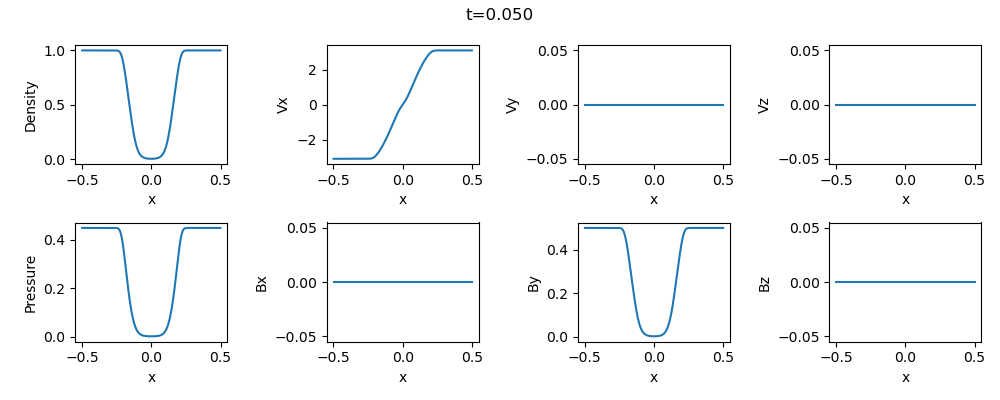

## Shock Tube Problem
The shock tube problem is a standard benchmark test for compressible (M)HD simulations, in which fluids with two different thermodynamic states are separated by a diaphragm in a tube.

The diaphragm is instantaneously removed at *t=0*, and then fluids evolve to produce shocks, rarefaction waves, and discontinuities depending on the initial condition.

Here, you can demonstrate five standard MHD shock tube problems adopted by Miyoshi and Kusano[^1], by editting the macro `NUM` in `global.hpp`:
1. Dai & Woodward problem
2. Brio & Wu problem
3. Slow switch-off shock
4. Slow switch-off rarefaction
5. Super-fast expansion

Example results for each problem are shown below:

1. Dai & Woodward problem

2. Brio & Wu problem

3. Slow switch-off shock

4. Slow switch-off rarefaction

5. Super-fast expansion

[^1]:  [Miyoshi T. and Kusano K. 2005, JCP](https://www.sciencedirect.com/science/article/pii/S0021999105001142?via%3Dihub)
