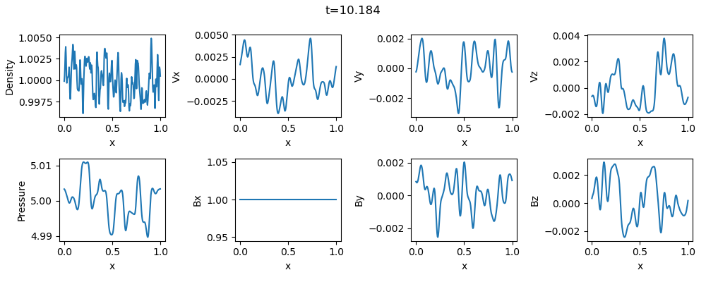
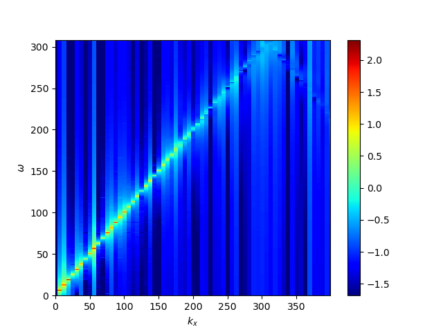
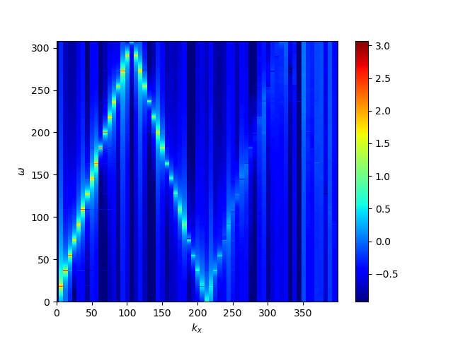
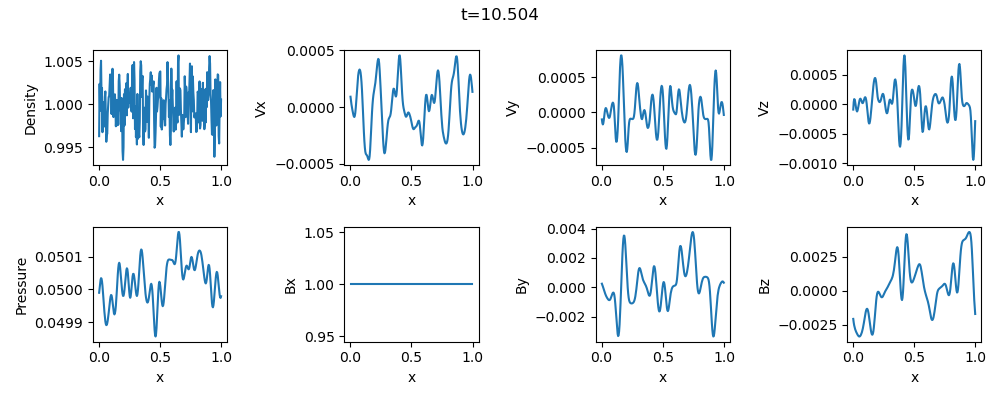
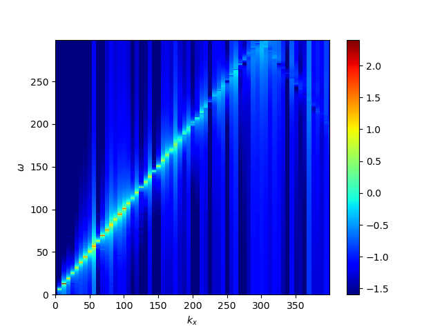
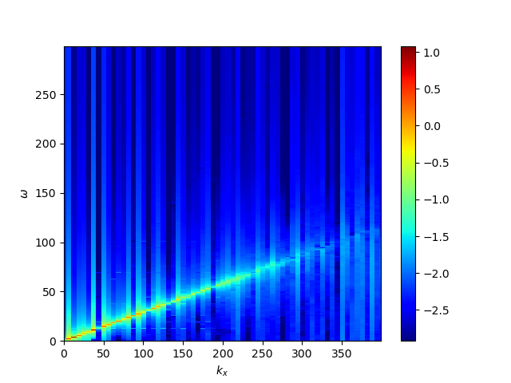

## Wave Propagation Problem
This problem demonstrates the propagation of MHD waves in homogeneous plasma to confirm that the code successfully satisfies the linear dispersion. 
Random white noise is added to the magnetic field and pressure, and their perturabations propagate as the Alfven and magnetosonic waves.

Example results for high and low beta cases are shown below: 
(Top...spatial profiles, bottom left...spectrum of the magnetic field, bottom right...spectrum of the pressure. Users can create the spectrum plot with the scripts `batch_a.py` and `wk_plt.py`)

1. `beta=10` in `mhd1d_init_.cpp`. The pressure perturbation propagates as the fast magnetosonic wave.

2. `beta=0.1` in `mhd1d_init_.cpp`. The pressure perturbation propagates as the slow magnetosonic wave.

## License

This project is licensed under the GNU General Public License v3.0 - see the [license](../../../license/COPYING) file for details.
