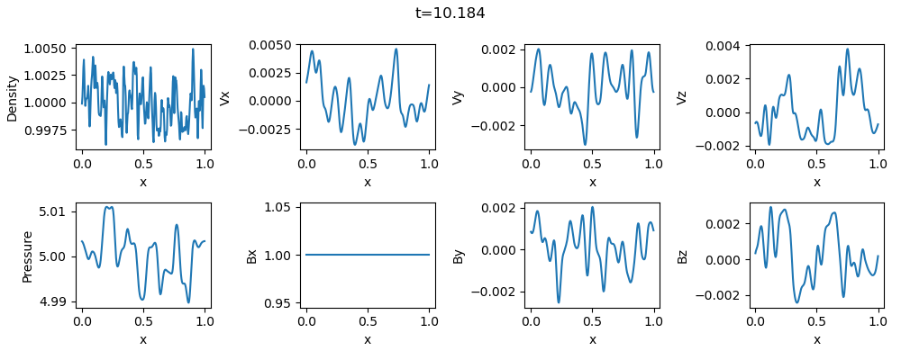
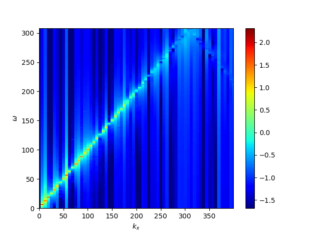
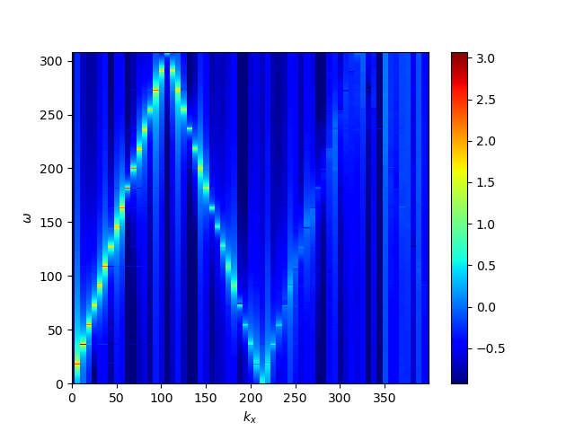
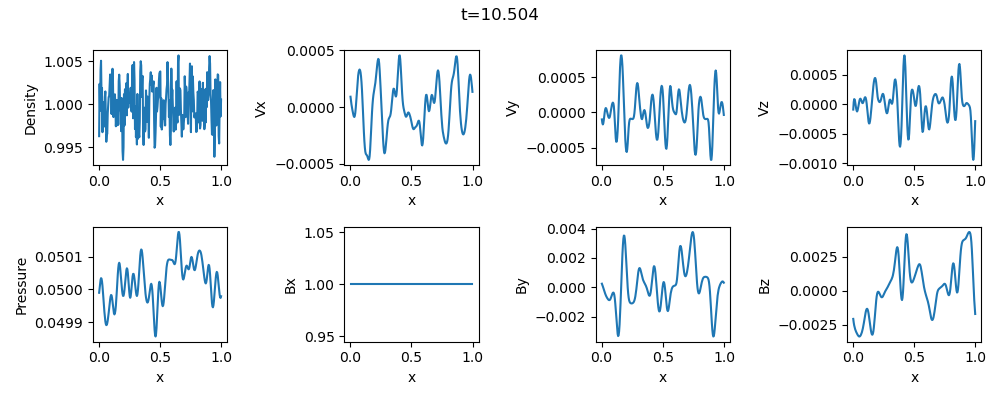
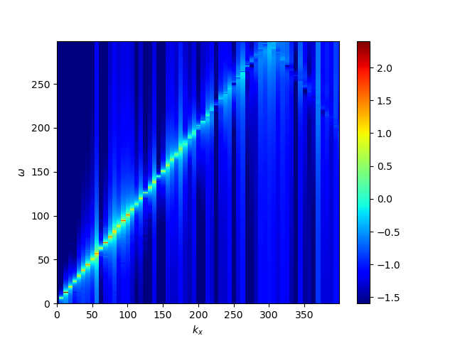
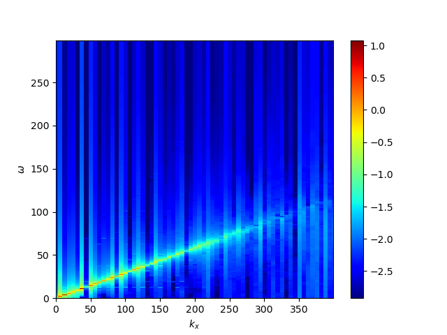

## Wave propagation problem
This problem demonstrates the propagation of MHD waves in homogeneous plasma to confirm that the code successfully satisfies the linear solution.

Random white noise is added to the magnetic field and pressure, and the perturabations propagate as the Alfven and magnetosonic waves.

Exsample results for high and low beta cases are shown below (Top...wave profiles, bottom left...spectrum of the magnetic field, bottom right...spectrum fo the pressure):

1. Beta=10. The pressure perturbation propagates as the fast magnetosonic wave.

2. Beta=0.1. The pressure perturbation propagates as the slow magnetosonic wave.

