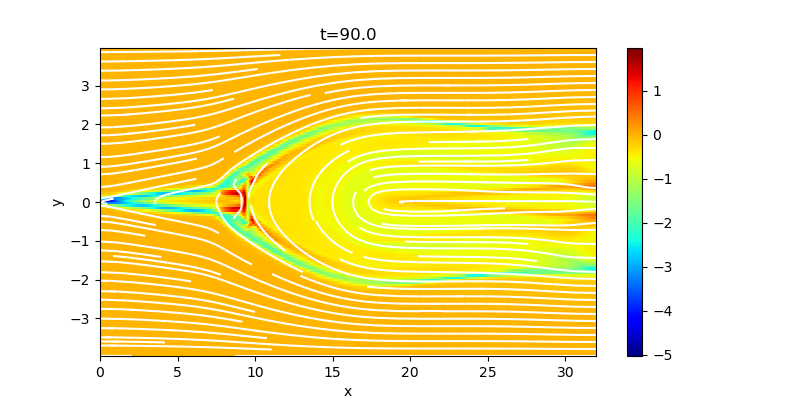

## Magnetic reconnection

In highly conducting plasma with antiparallel magnetic fields, dissipation of electric current may cause rapid change of magnetic topology and the convertion of magnetic energy into kinetic and thermal energies, known as magnetic reconnection.
The initial condition is the Harris equilibrium (standard setup for reconnection study), *(&rho;,vx,vy,vz,Bx,By,Bz)*=*(&rho;0/cosh2(y/&lambda;)+&rho;1,0,0,0,B0tanh(y/&lambda;),0,0)* where *&rho;0=B0=&lambda;=1,&rho;1=0.2*, and *-4<y<4*. 
The pressure is determined from the pressure balance *(P+B2/2=const)* and the plasma beta at the upstream region *(|y|>>&lambda;)* is 0.2. 
The reconnection is triggered by adding a magnetic perturbation around the center.

In MHD simualtions, the evolution of magnetic reconnection strongly depends on the resistivity model, which is described phenomenologically. 
Uniform resistivity leads to elongated current sheet and slow reconnection (Sweet-Paker model), while localized resistivity leads to fast Petscheck-type reconnection. 
Following example shows the out-of-plane current for localized resistivity (*&propto;exp(-(x2+y2)/&lambda;)*, defined in `dmhd2d_init_.cpp`).

