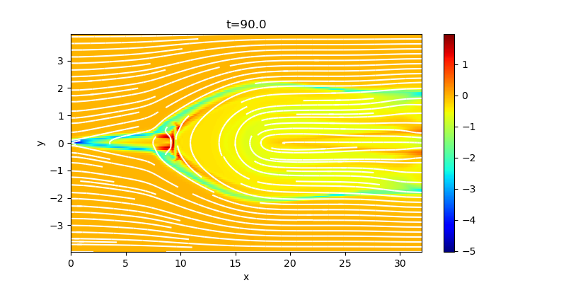

## Magnetic reconnection

In highly conducting plasma with antiparallel magnetic fields, dissipation of electric current causes rapid change of magnetic topology and the convertion of magnetic energy into kinetic and thermal energies, known as magnetic reconnection. 
The initial condition is the Harris equilibrium, *(&rho;,vx,vy,vz,Bx,By,Bz)*=*(&rho;0/cosh2(y/&lambda;)+&rho;1,0,0,0,B0tanh(y/&lambda;),0,0)* where *&rho;0=B0=&lambda;=1,&rho;1=0.2*, and *-4<y<4*. 
The pressure is determined from the pressure balance *(P+B2/2=const)* and the plasma beta at the upstream region *(|y|>>&lambda;)* is 0.2. 
The reconnection is triggered by adding a magnetic perturbation around the center.

In MHD simualtions, the evolution of magnetic reconnection strongly depends on the resistivity model, which is given phenomenologically. 
Uniform resistivity leads to elongated current sheet and slow reconnection (Sweet-Paker model), while localized resistivity causes fast Petscheck-type reconnection. 
Following example is the out-of-plane current with localized resistivity (*&propto;exp(-(x2+y2)/&lambda;)*, defined in `dmhd2d_init_.cpp`), showing Petscheck-like bifurcated structure.

### Code organization

The MPI `MHD2D` and `DMHD2D` implementations are in `../common/`. This directory retains `dmhd2d_init_.cpp` (including `setdc()`), parameters, macros, and the driver. The Makefile selects the dissipative sources with `DISSIPATION = 1`.

Run `make` in this directory; it compiles shared sources with the local `mymacros.hpp` and stores objects in `build/`. See [the MPI guide](../README.md) for build, execution, and result-merging instructions.

Random velocity perturbations use `rand_noise_mt()` with a common base seed and the X rank coordinate; ranks sharing an X subdomain use the same sequence across Y. The temporary `dvy` array is a checked `std::vector`. See [the MPI guide](../README.md) for fixed-seed runs and reproducibility limits.

The diffusion substep safety coefficient is 6, matching SERIAL. The existing ideal/dissipative splitting order is retained.

## License

This project is licensed under the GNU General Public License v3.0 - see the [license](../../../license/COPYING) file for details.
