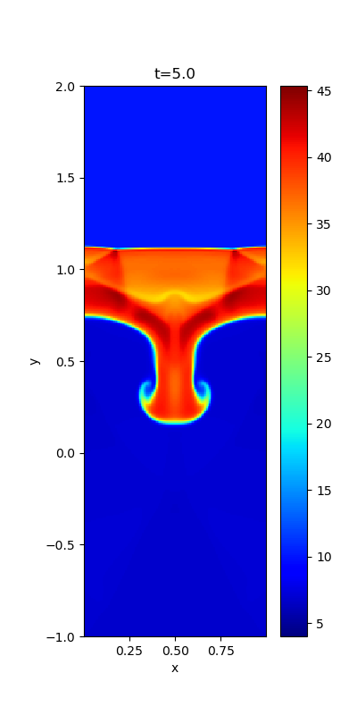
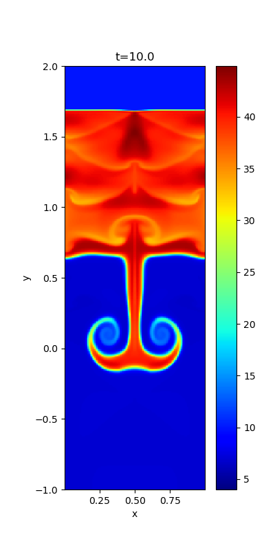
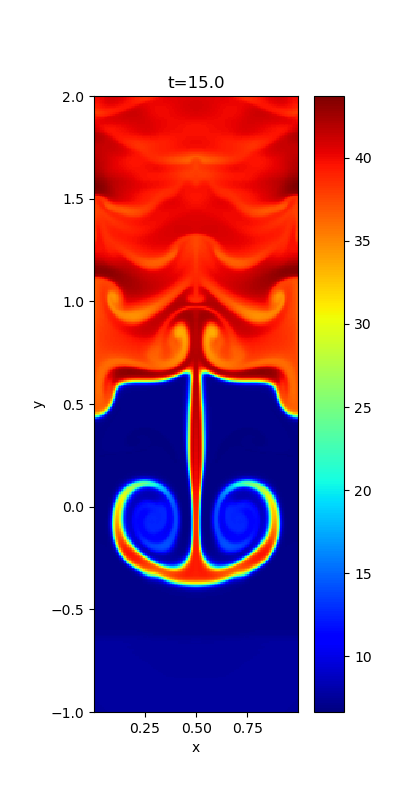

## Richtmyer-Meshkov instability

When a shock collides with a corrugated contact discontinuity, the interface develops nonlinearly via the Richtmyer-Meshkov instability (RMI). 
The shock is initially located at *y=0* and the upstream variables at *y<0* are set to be *(&rho;,vx,vy,vz,Bx,By,Bz,P)*=*(1,0,-1,0,0.0000346,0,0,0.00006)* so that the Mach number and the plasma beta are 100 and 105. 
The downstream variables are set to satisfy the Rankine-Hugoniot condition. 
A corrugated contact discontinuity is imposed in the upstream region, and the density behind the discontinuity is 10. 

Density profiles at three periods are shown below. 
This simulation is performed in a frame moving with *vy=-0.6* so that the structure of RMI remains at approximately *y=0*.

