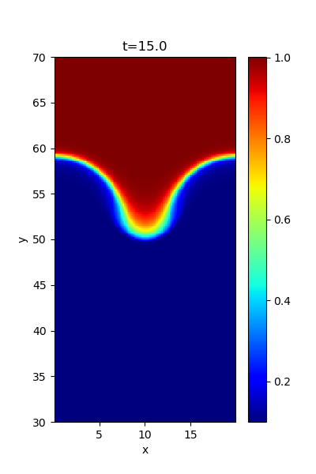

## Rayleigh-Taylor instability

When heavy fluid is located above light fluid, the system is unstable against the gravity, known the Rayleigh-Taylor instability. 
The instability also occurs when heavy fluid is accelerated toward light fluid. 
The interface is set at *y=y0=&pm;56*, and the density is *&rho;=1.0* (for *y>|y0|*) and *&rho;=0.1* (for *y<|y0|*) where *-80<y<80* (the system is symmetric with respect to *y=0*). 
The gravitational potential is given as *&Phi;=g0 &lambda;glog(cosh(y/&lambda;g))* where *g0=1.0* and *&lambda;g=8&Delta;y*. 
The pressure is determined to satisfy the hydrostatic equilibrium. 

Example density profiles at t=15.0,20.0 are shown below.

