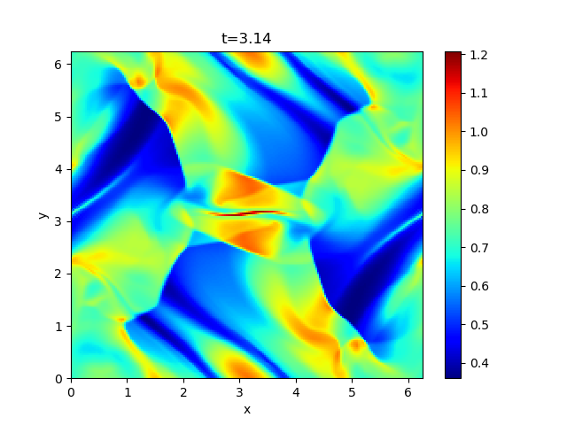

## Orszag-Tang Vortex

The Orszag-Tang vortex problem is a standard benchmark test for the two-dimensional MHD simulation adopted in many literatures, to verify the capability of capturing multiple interactions of shocks and vortices.

The initial condition is *(&rho;,vx,vy,vz,Bx,By,Bz,P)*=*(&gamma;2,-sin(y),sin(x),0,-sin(y),sin(2x),0,&gamma;)* where *&gamma;*=5/3 is specific heat ratio, and *0<x,y<2&pi;*.

An example of the temperature *(=P/&rho;)* profile at *t=&pi;* is shown below.

