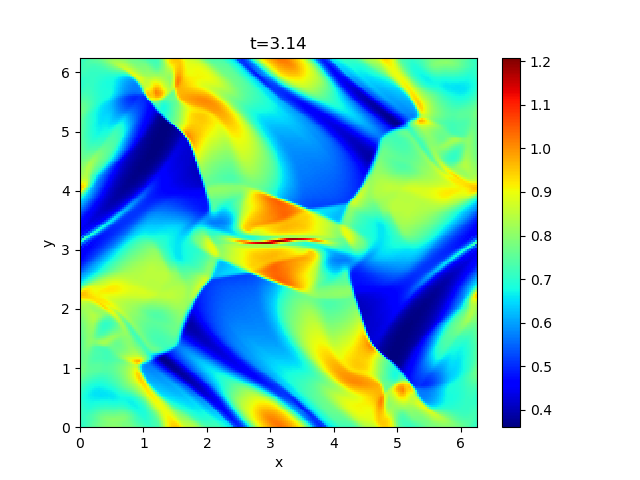

## Orszag-Tang Vortex Problem

The Orszag-Tang vortex problem is a standard benchmark test for the two-dimensional MHD simulation adopted in many literatures, to verify the capability of capturing multiple interactions of shocks and vortices. 
The initial condition is *(&rho;,vx,vy,vz,Bx,By,Bz,P)*=*(&gamma;2,-sin(y),sin(x),0,-sin(y),sin(2x),0,&gamma;)* where *&gamma;*=5/3 is specific heat ratio, and *0<x,y<2&pi;*.

An example of the temperature *(=P/&rho;)* profile at *t=&pi;* is shown below.

### Serial configuration

This case uses the shared `MHD2D` class and solver in `../common/`. Edit `mhd2d_init_.cpp` for the initial state, `mhd2d_paras.cpp` for the domain and boundary conditions, and `mymacros.hpp` for the mesh, output, and solver settings.

The `setup_grid()` call explicitly supplies coordinate shifts `0.0, 0.0`, unlike the default half-cell shifts used by the other cases. Preserve these arguments when changing the domain to retain this case's original coordinate convention.

See the [serial build and visualization instructions](../README.md). Build with `make` in this directory; objects are kept in `build/`, the executable is `a.out`, and results are written to `dat/`. Run the linked `python batch.py` from this directory to inspect the results.

## License

This project is licensed under the GNU General Public License v3.0 - see the [license](../../../license/COPYING) file for details.
