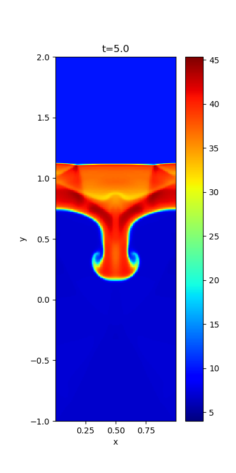
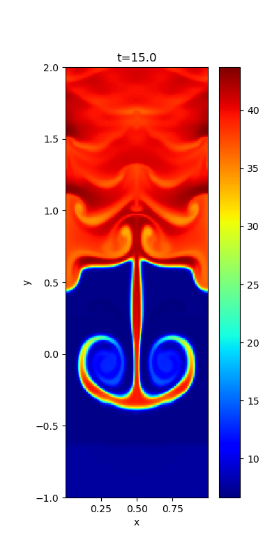

## Richtmyer-Meshkov instability

When a shock collides with a corrugated contact discontinuity, the interface develops nonlinearly via the Richtmyer-Meshkov instability (RMI). 
The shock is initially located at *y=0* and the upstream variables at *y>0* are *(&rho;,vx,vy,vz,Bx,By,Bz,P)*=*(1,0,-1,0,0.0000346,0,0,0.00006)* so that the Mach number and the plasma beta are 100 and 105[^1][^2]. 
The downstream variables at *y<0* are set to satisfy the Rankine-Hugoniot condition. 
A corrugated contact discontinuity is imposed in the upstream region, and the density increases to *&rho;=10* behind the discontinuity.

Density profiles at *t=5.0,15.0* are shown below. 
This simulation was performed in a frame moving with *vy=-0.6* so that the structure of RMI remains at approximately *y=0*.

### Serial configuration

The local `RMI2D` class in `rmi2d_class.hpp/.cpp` derives from the shared `MHD2D` in `../common/`. Edit `rmi2d_init_.cpp` for the initial shock/contact state and inflow parameters, and `mhd2d_paras.cpp` for `setup_grid()` and ordinary boundary conditions.

`RANDOM=0` in `mymacros.hpp` selects the single-mode contact corrugation without density noise. `RANDOM=1` enables random phases and density perturbations. `rand_noise_mt()` uses one generator per instance, seeded in `rmi2d_init_.cpp`; replace the time-based `seed` with a fixed value for reproducibility.

`RMI2D::exec_()` refreshes the upper inflow once before each ideal-MHD timestep. The overridden `bound()` reuses the stored density values throughout the RK stages, without advancing the generator. The physical upper `By` face remains evolved by CT.

See the [serial build and visualization instructions](../README.md). Build with `make` in this directory; objects are kept in `build/`, the executable is `a.out`, and results are written to `dat/`.

## License

This project is licensed under the GNU General Public License v3.0 - see the [license](../../../license/COPYING) file for details.

[^1]: [Minoshima T., Kitamura K., and Miyoshi T. 2020, ApJS](https://iopscience.iop.org/article/10.3847/1538-4365/ab8aee/meta)
[^2]: [Minoshima T. and Miyoshi T. 2021, JCP](https://www.sciencedirect.com/science/article/pii/S0021999121005349)
