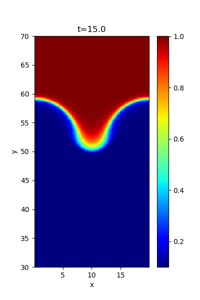
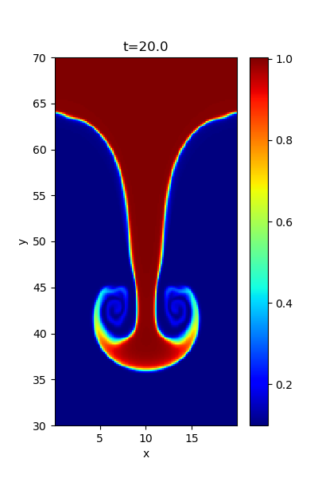

## Rayleigh-Taylor instability

When a heavy fluid is located above a light fluid, the system is unstable against the gravity, known as the Rayleigh-Taylor instability. 
The instability also occurs when a heavy fluid is accelerated toward a light fluid. 
The interface is set at *y=y0=&pm;56*, and the density is *&rho;=1.0* (for *y>|y0|*) and *&rho;=0.1* (for *y<|y0|*) where *-80<y<80* (the system is symmetric with respect to *y=0*). 
The gravitational potential is given as *&Phi;=g0 &lambda;glog(cosh(y/&lambda;g))* where *g0=1.0* and *&lambda;g=8&Delta;y*. 
The pressure is determined to satisfy the hydrostatic equilibrium. 

Example density profiles at t=15.0,20.0 are shown below.

### Serial configuration

This case uses the shared gravity-aware `GMHD2D` implementation in `../common/`; its Makefile selects the gravity sources with `GRAVITY := 1`. `gmhd2d_init_.cpp` defines the initial state, prescribed potential, and `GMHD2D::bound()`. The latter contains the special upper/lower energy correction for this RTI setup, not a general-purpose gravitational boundary condition.

Edit `mhd2d_paras.cpp` for `setup_grid()` and ordinary boundary flags. `RANDOM=0` in `mymacros.hpp` uses the single-mode velocity perturbation; `RANDOM=1` uses `rand_noise_mt()`. Set a fixed `seed` in `gmhd2d_init_.cpp` for reproducibility; the default is time-based.

The conserved total energy includes `rho*phi_g`. The potential is written once to `dat/g_potential.dat` as binary doubles with shape `(ny, nx)`, including ghost cells. The shared `batch.py` and `batch_a.py` load this file when present and subtract `rho*phi_g` before deriving gas pressure and temperature. `batch_a.py` applies the same time-independent potential to every output, using each output's density. Missing files select the ordinary MHD formula; invalid file sizes or non-finite potential values raise an error. Keep `g_potential.dat` with the corresponding RTI output when copying or archiving results.

See the [serial build and visualization instructions](../README.md). Build with `make` in this directory; objects are kept in `build/`, the executable is `a.out`, and results are written to `dat/`.

## License

This project is licensed under the GNU General Public License v3.0 - see the [license](../../../license/COPYING) file for details.
