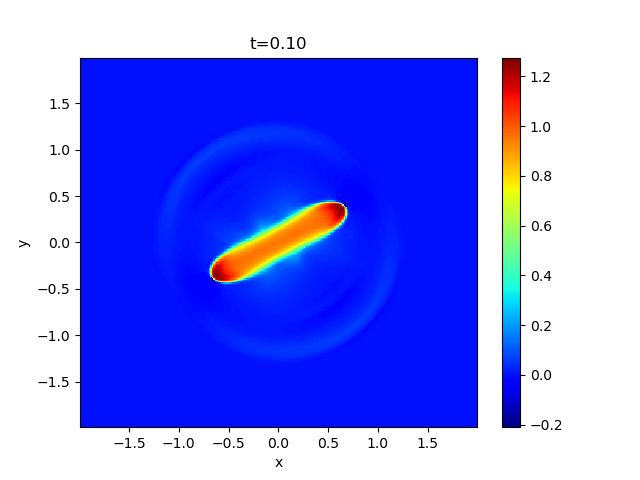
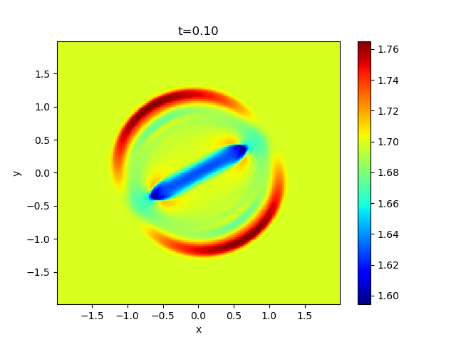

## Blast Wave Problem

This problem suggested by Balsara & Spicer[^1] demonstrates the propagation of MHD shocks in strongly magnetized meidum to assess the robustness of the code. 
The initial condition is *(&rho;,vx,vy,vz,Bx,By,Bz,P)*=*(1,0,0,0,10sin(&theta;),10cos(&theta;),0,1)*, and then a high pressure cylinder is imposed at the center of the domain, *P=100* for *&radic;(x2+y2)<0.125* where *-2<x,y<2*.

The example result of the gas and magnetic pressures for *&theta;=30&deg;* is shown below (in logarithmic scale).

 

## License

This project is licensed under the GNU General Public License v3.0 - see the [license](../../../license/COPYING) file for details.

[^1]: [Balsara, D. S., and Spicer, D. S. 1999, JCP](https://www.sciencedirect.com/science/article/abs/pii/S0021999198961538?via%3Dihub)
