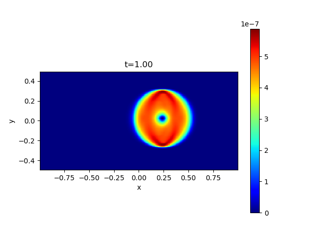
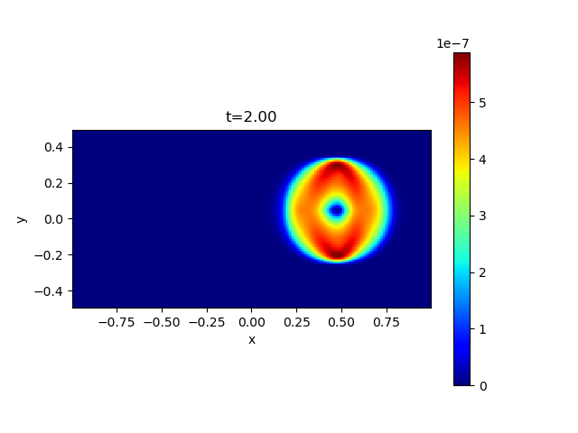

## Field Loop Advection Problem

This problem is first suggested by Gardiner & Stone[^1] to assess the capability to preserve the shape of a weak magnetic field loop during the advection. 
The initial condition is *(&rho;,vx,vy,vz,Bz,P)*=*(1,&radic;5cos(&theta;),&radic;5sin(&theta;),0,0,P0)*, and *(Bx, By)* are calculated from the vector potential *Az=*max*(10-3(0.3-r),0)* where *r2=x2+y2* and *-1<x<1, -0.5<y<0.5*. 
The problem is stringent especially when the flow is well aligned to the axis *(&theta;~0 or &pi;/2)*[^2] and/or the flow is subsonic *(P0>>1)*[^3].

The example results of the magnetic pressure for *&theta;=0.01* and *P0=1* are shown below.

 

[^1]: [Gardiner T. A., and Stone J. M. 2005, JCP](https://www.sciencedirect.com/science/article/pii/S0021999104004784)
[^2]: [Lee, D. 2013, JCP](https://www.sciencedirect.com/science/article/pii/S0021999113001836?via%3Dihub)
[^3]: [Minoshima T., Miyoshi T., and Matsumoto Y. 2019, ApJS](https://iopscience.iop.org/article/10.3847/1538-4365/ab1a36/meta)
