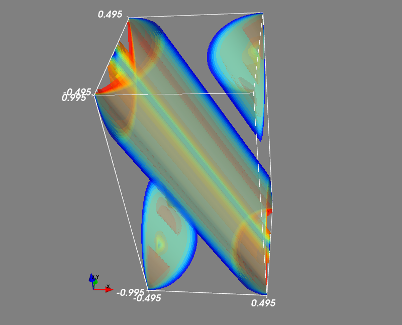

## Field Loop Advection Problem

This is the three-dimensional extension of the field loop advection problem conducted by Gardiner & Stone[^1], and further by Lee[^2] for the small-angle advection. 
The periodic computational domain is *-0.5<x<0.5,-0.5<y<0.5,-1<z<1*. 
A weak magnetic loop is tilted around the *y* axis by an angle of *tan-1(1/2)* and flows almost in the *x-z* plane. 
(For details of the initial condition, see the literture[^3])

An example result of the magnetic pressure at one period is shown below. 

[^1]: [Gardiner T. A., and Stone J. M. 2008, JCP](https://www.sciencedirect.com/science/article/pii/S0021999107005669?via%3Dihub) 
[^2]: [Lee, D. 2013, JCP](https://www.sciencedirect.com/science/article/pii/S0021999113001836?via%3Dihub)
[^3]: [Minoshima T., Miyoshi T., and Matsumoto Y. 2019, ApJS](https://iopscience.iop.org/article/10.3847/1538-4365/ab1a36/meta)
